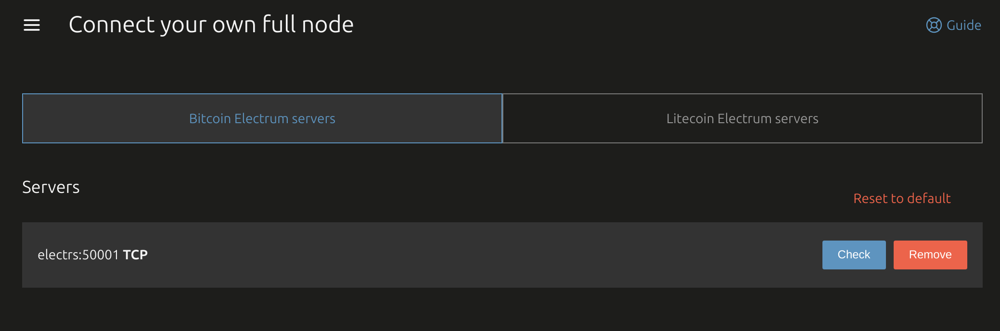

# Electrs

|              |                                                                    |
| ------------ | ------------------------------------------------------------------ |
| Homepage     | https://github.com/romanz/electrs                                  |
| Docker image | https://hub.docker.com/r/getumbrel/electrs                         |
| Dockerfile   | https://github.com/getumbrel/docker-electrs/blob/master/Dockerfile |

Electrs is an implementation of the Electrum Server, which provides efficient querying of blockchain data and is used by wallet software to interact with the blockchain. It requires a full Bitcoin node (Core or Knots) to operate. Electrs uses persistent volume storage mounted at `/data`.

```sh
# Required configuration
pulumi config set electrs:enabled true

# Optional configuration
pulumi config set electrs:version v0.10.9

pulumi up
```

Once indexing finishes, use `electrs:50001` to connect your wallets.

---

## Wallet Configuration

This guide shows how to configure popular Bitcoin wallets to connect to your self-hosted Electrs server running on port 50001 via Tailscale.

The assumption is that you already have the wallet working with public servers, so f.e. udev rules are imported to access USB device.

```sh
# Enable Bitcoin Core node
pulumi config set bitcoin-core:enabled true
# or Bitcoin Knots
pulumi config set bitcoin-knots:enabled true
pulumi up
# Wait for initial blockchain sync to complete (this can take a few hours)

# Then enable Electrs
pulumi config set electrs:enabled true
pulumi up
# Wait for indexing to finish (this can take a few hours)
```

Use `electrs:50001` to connect your wallet software. SSL is not used as Tailscale already encrypts all traffic.

---

### BitBox App

1. Open BitBox App
2. Go to **Settings > Advanced settings > Connect your own full node**
3. Add your Electrs server `electrs:50001`
4. Remove all existing public Electrum server entries so only your instance is used
5. Save and restart the app if needed



---

### Sparrow Wallet

1. Open Sparrow Wallet
2. Go to **File > Settings... > Server**
3. Set the server type to **Private Electrum**
4. Add your Electrs server `electrs:50001`
5. Click **Test Connection**
6. Save settings


