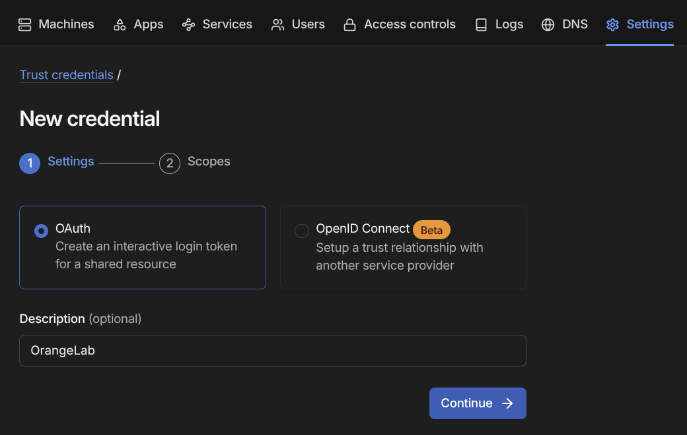

# Tailscale Kubernetes-operator

|                |                                                                                            |
| -------------- | ------------------------------------------------------------------------------------------ |
| Homepage       | https://tailscale.com/kb/1236/kubernetes-operator                                          |
| Versions       | https://tailscale.com/changelog                                                            |
| Default values | https://github.com/tailscale/tailscale/blob/main/cmd/k8s-operator/deploy/chart/values.yaml |
| Endpoints      | `https://k8s.<tsnet>.ts.net/`                                                              |

The operator manages cluster ingress endpoints on Tailnet as well as adds Tailscale authenticated Kubernetes API endpoint.

## Installation

### DNS/HTTPS

Enable MagicDNS and HTTPS certificates on https://login.tailscale.com/admin/dns

### Tags

Add `orangelab` tag to your Tailnet ACLs (https://login.tailscale.com/admin/acls/file):

```json
"tagOwners": {
    "tag:orangelab":   [],
}
```

### OAuth token

Create Tailscale OAuth token for OrangeLab (https://login.tailscale.com/admin/settings/trust-credentials)



Make sure token has write permissions for `Devices/Core` and `Keys/Auth keys`.

Assign `orangelab` tag as well.


Add the token values to `Pulumi.<stack>.yaml`.

You can find Tailnet DNS name at https://login.tailscale.com/admin/dns

```sh
pulumi config set tailscale:tailnet <*.ts.net*>
pulumi config set tailscale:oauthClientId <OAUTH_CLIENT_ID>
pulumi config set tailscale:oauthClientSecret <OAUTH_CLIENT_SECRET> --secret
pulumi config set tailscale:enabled true

pulumi up
```

## Kubernetes API access (optional)

After deploying the operator, you can use new endpoint for Kubernetes API, `https://k8s.<tailnet>.ts.net` for non-admin users.

Add this grant to your Tailscale ACLs:

```json
"grants": [{
    "src": ["autogroup:member"],
    "dst": ["tag:orangelab"],
    "app": {
        "tailscale.com/cap/kubernetes": [{
            "impersonate": {
                "groups": ["orangelab:users"],
            },
        }],
    },
}]
```

To be able to connect to the cluster as a read-only user, generate `~/.kube/config` with:

```sh
tailscale configure kubeconfig k8s
```

## Uninstall

```sh
pulumi config set tailscale:enabled false
pulumi up

kubectl delete crd \
  connectors.tailscale.com \
  dnsconfigs.tailscale.com \
  proxyclasses.tailscale.com \
  proxygroups.tailscale.com \
  recorders.tailscale.com

kubectl delete clusterrole \
  tailscale-auth-proxy \
  tailscale-operator

kubectl delete clusterrolebinding \
  tailscale-auth-proxy \
  tailscale-operator

# This will remove all existing ingress instances using tailscale class
# They will be recreated once tailscale-operator is installed again
kubectl delete ingressclass tailscale
```

**Important:** Remove any leftover nodes with `tag:orangelab` at https://login.tailscale.com/admin/machines, otherwise Tailscale will create `<app>-1` entries and connections will fail.
