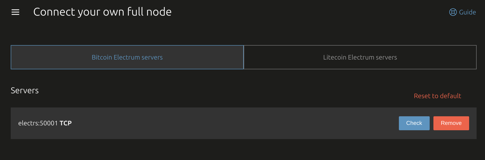
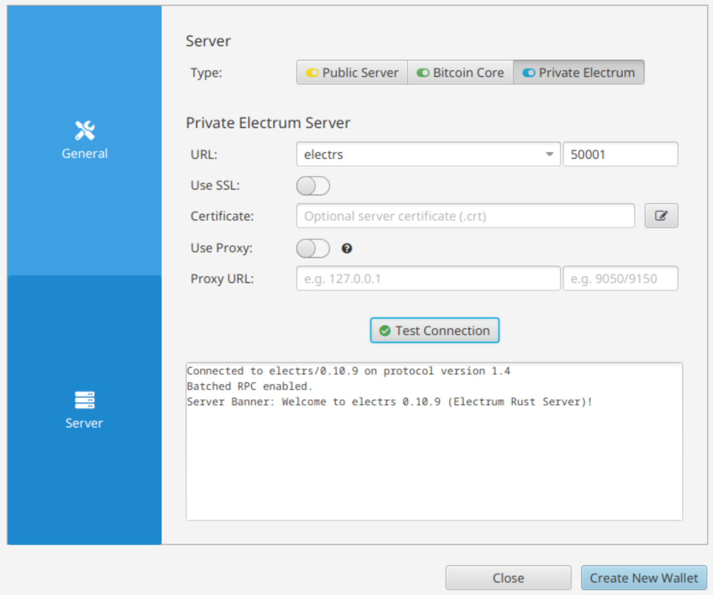

# Using Electrs with Bitcoin Wallets

This guide shows how to configure popular Bitcoin wallets to connect to your self-hosted Electrs server running on port 50001 via Tailscale.

The assumption is that you already have the wallet working with public servers, so f.e. udev rules are imported to access USB device.

```sh
# Enable Bitcoin Core node
pulumi config set bitcoin-core:enabled true
# or Bitcoin Knots
pulumi config set bitcoin-knots:enabled true
pulumi up
# Wait for initial blockchain sync to complete (this can take a few hours)

# Then enable Electrs
pulumi config set electrs:enabled true
pulumi up
# Wait for indexing to finish (this can take a few hours)
```

Use `electrs:50001` to connect your wallet software. SSL is not used as Tailscale already encrypts all traffic.

---

## BitBox App

1. Open BitBox App
2. Go to **Settings > Electrum server**
3. Add your Electrs server `electrs:50001`
4. Remove all existing public Electrum server entries so only your instance is used
5. Save and restart the app if needed



---

## Sparrow Wallet

1. Open Sparrow Wallet
2. Go to **Preferences > Server**
3. Set the server type to **Electrum**
4. Add your Electrs server `electrs:50001`
5. Click **Test Connection**
6. Save settings


